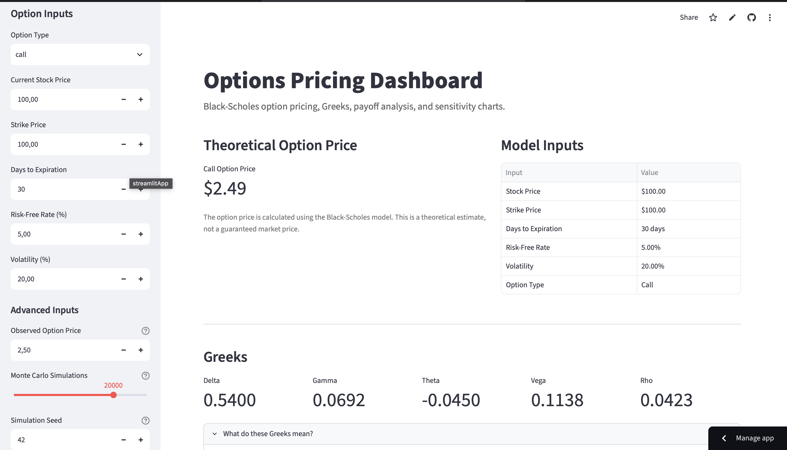
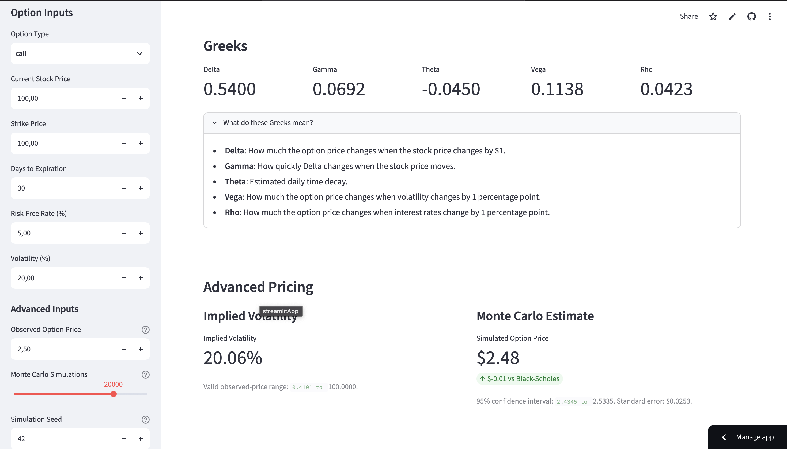
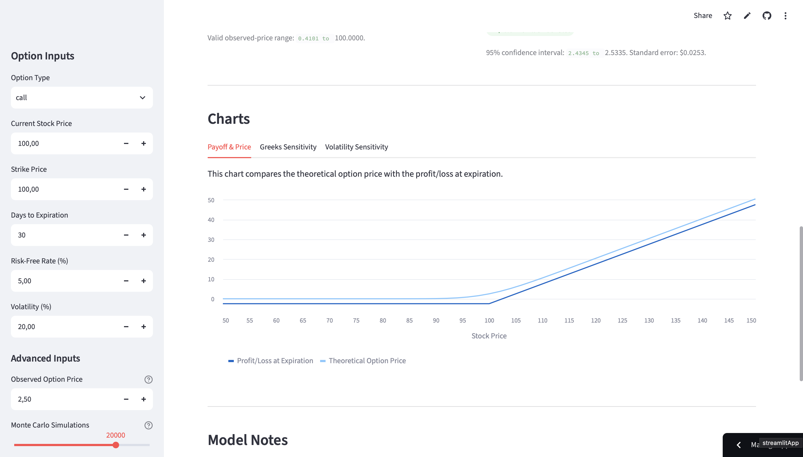

# Options Pricing Dashboard

[](https://github.com/YasserJJJJ/options-pricing-dashboard/actions/workflows/tests.yml)


[](https://quant-options-dashboard.streamlit.app)

An interactive quantitative finance dashboard for pricing European call and put options using Black-Scholes and Monte Carlo methods.

**[Launch the live application](https://quant-options-dashboard.streamlit.app)**



## Overview

This project provides an interactive interface for exploring European option pricing and risk metrics. Users can modify market parameters and immediately observe how option values, Greeks, payoff profiles, and sensitivity curves respond.

The project combines quantitative finance, numerical methods, automated testing, continuous integration, and interactive data visualization.

## Features

- European call and put option pricing
- Analytical Black-Scholes valuation
- Delta, Gamma, Theta, Vega, and Rho calculations
- Implied volatility estimation using adaptive bisection
- Monte Carlo pricing with reproducible simulations
- Standard error and 95% confidence intervals
- Profit and loss analysis at expiration
- Stock-price sensitivity analysis
- Greeks sensitivity charts
- Volatility sensitivity charts
- Input validation and user-friendly warnings
- Cached simulations for responsive Streamlit reruns

## Pricing Methods

### Black-Scholes

The application calculates analytical prices for European options under the Black-Scholes assumptions.

### Implied Volatility

Implied volatility is estimated using a bisection solver with an adaptive search range. The implementation validates theoretical option-price bounds and handles prices without a finite implied volatility.

### Monte Carlo Simulation

The Monte Carlo engine simulates terminal stock prices under risk-neutral geometric Brownian motion. It returns:

- Estimated option price
- Standard error
- 95% confidence interval
- Reproducible results using a simulation seed

## Additional Screenshots

<details>
<summary><strong>Advanced pricing and Greeks</strong></summary>

<br>



</details>

<details>
<summary><strong>Payoff and theoretical price chart</strong></summary>

<br>



</details>

## Technology Stack

| Technology | Purpose |
|---|---|
| Python | Pricing models and numerical calculations |
| Streamlit | Interactive dashboard interface |
| Pandas | Tabular data preparation |
| Pytest | Automated unit and interface testing |
| Pytest-cov | Branch and statement coverage |
| GitHub Actions | Continuous integration |
| Streamlit Community Cloud | Public deployment |

## Testing

The project includes unit, numerical, validation, Monte Carlo, and Streamlit interface tests.

Current results:

- 56 automated tests
- 98% code coverage
- Automated GitHub Actions verification
- Streamlit interface interaction testing

Run the complete suite:

```bash
python -m pip install -r requirements-dev.txt

python -m pytest \
  --cov=black_scholes \
  --cov-branch \
  --cov-report=term-missing \
  --cov-fail-under=95
```

## Project Structure

```text
options-pricing-dashboard/
├── .github/
│   └── workflows/
│       └── tests.yml
├── assets/
│   ├── advanced-pricing.png
│   ├── dashboard-preview.png
│   └── payoff-chart.png
├── tests/
│   ├── test_app.py
│   └── test_black_scholes.py
├── app.py
├── black_scholes.py
├── pytest.ini
├── requirements.txt
├── requirements-dev.txt
└── README.md
```

## Run Locally

```bash
git clone https://github.com/YasserJJJJ/options-pricing-dashboard.git
cd options-pricing-dashboard

python3 -m venv .venv
source .venv/bin/activate

python -m pip install --upgrade pip
python -m pip install -r requirements.txt
python -m streamlit run app.py
```

On Windows, activate the environment with:

```text
.venv\Scripts\activate
```

## Model Assumptions

The Black-Scholes implementation assumes:

- European-style options
- No early exercise
- Constant volatility
- Constant risk-free interest rate
- No transaction costs
- Efficient markets
- Lognormally distributed stock prices

## Disclaimer

This project is intended for educational and portfolio purposes only. It does not provide financial advice or guarantee market outcomes.